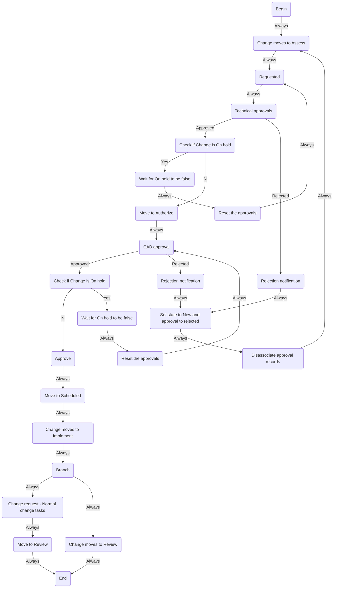

The other day I was looking at my mermaidjs flows and wanted to see how
they would render a servicenow workflow.

I created a UI page to do this, you just have to pass it a context
`sys_id` today but this could be improved.

## UI Action

```js
/*
Name: Show Mermaid
Table: Workflow Context[wf_context]
Client: [True]
OnClick: showWorkflowContextMermaid();
Script:
*/
function showWorkflowContextMermaid() {
    var id = g_form.getUniqueValue();
    var url = new GlideURL('/mermaid.do');
    url.addParam('sysparm_stack', 'no');
    url.addParam('context', id);
    g_navigation.open(url.getURL(), "_blank");
}
```

## UI Page

``` {.xml}
<?xml version="1.0" encoding="utf-8" ?>
<j:jelly trim="false" xmlns:j="jelly:core" xmlns:g="glide" xmlns:j2="null" xmlns:g2="null">
<body>
<g:evaluate>
var output = [];
var wf_context = new GlideRecord('wf_context');
  if(wf_context.get(RP.getParameterValue('context'))){
      var wf_activity = new GlideRecord("wf_activity");
      wf_activity.addQuery('workflow_version', wf_context.getValue('workflow_version'));
      wf_activity.orderBy('x');
      // wf_activity.orderBy('y');
      var query = wf_activity.getEncodedQuery();
      wf_activity.query();
      while(wf_activity.next()){
        // gs.info(wf_activity.getValue('sys_id') + '(' + wf_activity.name.toString().replace(/\"/g,'') + ')');
        output.push(wf_activity.getValue('sys_id') + '(' + wf_activity.name.toString().replace(/\"/g,'') + ')');
        var transitions = new GlideRecord('wf_transition');
        transitions.addQuery('from',wf_activity.getValue('sys_id'));
        transitions.query();
        while(transitions.next()){
          // output.push(wf_activity.getValue('sys_id') + '-->' + transitions.getValue('to'));
          output.push(wf_activity.getValue('sys_id') + '--' + transitions.condition.name.toString() + '-->' + transitions.getValue('to'));
        }
      }
     gs.info(output.toString().replace(/\,/g,'\n'));
output = output.toString().replace(/\,/g,'\n')
  } else {
      var query = 'No Workflow Found';
  }
gs.info(query);
</g:evaluate>
<div class="mermaid">
  graph TD
  ${output}
  </div>
    <div class="hidden">
      graph TD
      ${output}
    </div>
<script src="https://unpkg.com/mermaid@7.1.0/dist/mermaid.js" />
<script>
// mermaid.initialize({startOnLoad:true});
</script>
</body>
</j:jelly>
```

## Example Graph




