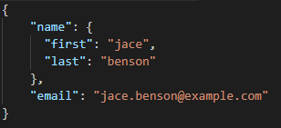
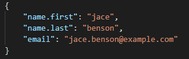
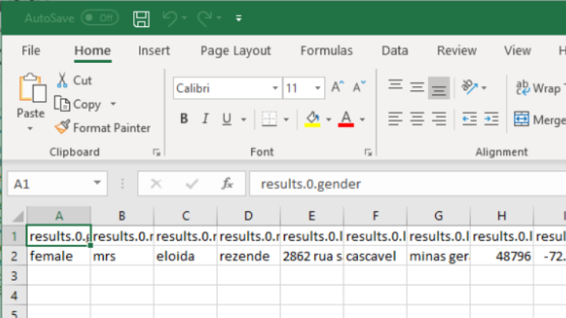
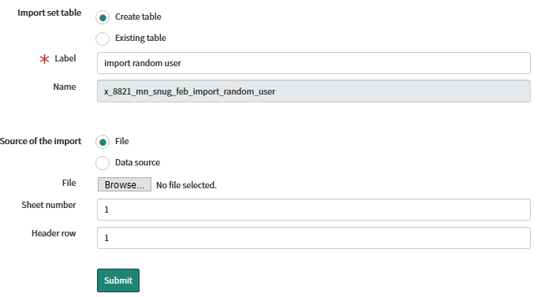
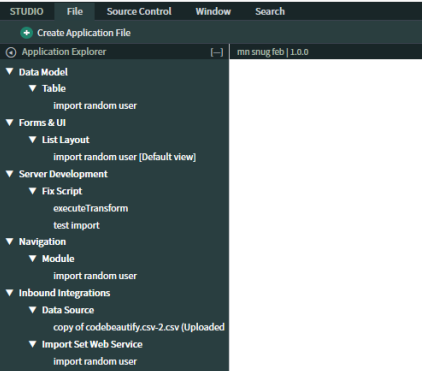

# Integrate repeatably faster

---

# Introduction

## Author: Jace Benson

---

## Why: Intregrations is a big part of what we do.  

If we follow a few simple steps it can save us a lot of time.

In the past 6 months my team's made integrations to Microsoft Intune, Webex, Solarwinds and Crashplan.  

Because we followed these steps modifications to these integrations has been simple for all members of the team to work on, 
and quick because the data was already present in the import set.

---

## What we will do

Walk through a complex JSON data source and use a import set to transform the data
  
Briefly talk about why we normally skip the import sets, and / or skip getting the details
  
---

## Getting started

- Ensure you have a instance up and ready.
- Open studio and import the scoped app from this url:
- <b>`https://github.com/jacebenson/mn-snug-feb-2019.git`</b>

---

# Navigating this apps' branches
  
| Branch | Description                                                             |
|------- | ----------------------------------------------------------------------- |
| Master | Bare minimum to show how this works                                     |
| 1      | Includes the Import Set Table (hardest part IMO)                        |
| 2      | Includes the Script Include to get the data and paginate over it        |

---

# Step one.  Getting the raw data
  
- Goto https://randomuser.me/api/ and copy the JSON
- We need to flatten the object to access each part of each object
- Goto https://codebeautify.org/json-to-csv and paste in the JSON.
- Press the Download and open in Excel

---

### What is Flattening the object do?
 
   
  Becomes 
  

---

# Checkpoint 1.

  You should have this

  
    
---

# Massaging the csv
  
- Replace `results.0.` with nothing
- Save the file
    
---

# Load the data

- System Import Sets -> Load Data

---

# Checkpoint 2.

  You should have this

  

  If you don't go ahead and switch your branch to 1.

---

# Transform that complex json

  - Go a in Studio
  - Create Application File "Table Transform Map"
  - Map Email, First Name, Last Name
  - Coalesce on Email

---

## Switch to branch 2

  - Because I dont want to have you all script it

  - This branch includes a script include to flatten the objects and paginate the results

---

## Take aways

- Following a common import strategy simplifies development for the team
  - Allows you to easily massage the data
  - Gives your customers the scope of the data you have access to
- REST API Integrations can follow this pattern
- After doing this once, you can easily do this again