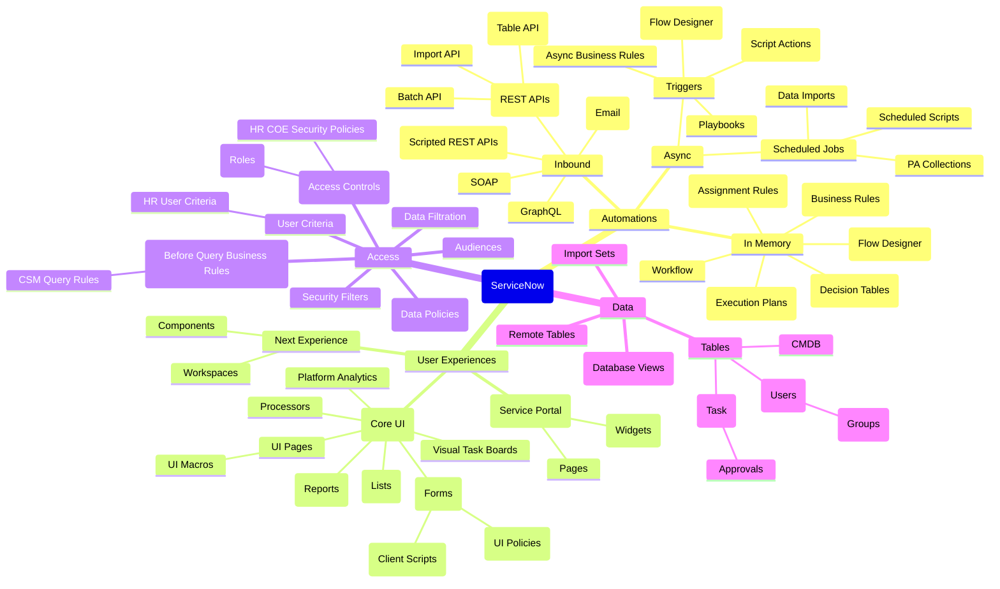

An interactive visual guide to learning ServiceNow development. Originally inspired by [roadmap.sh/r/sn-v2](https://roadmap.sh/r/sn-v2).

---

## Learning Paths

### For New Developers
1. **Data** → Tables and basic database concepts
2. **Core UI** → Forms and lists  
3. **Access** → Security fundamentals
4. **Inbound** → Integration basics

### For Experienced Developers
1. **Async** → Flow Designer and automation
2. **Next Experience** → Modern UI development
3. **Products** → App Engine and specialized applications
4. **In Memory** → Performance optimization

---

*Last updated: 2025. Want to suggest updates? [Open an issue](https://github.com/jacebenson/jace.pro/issues)*
