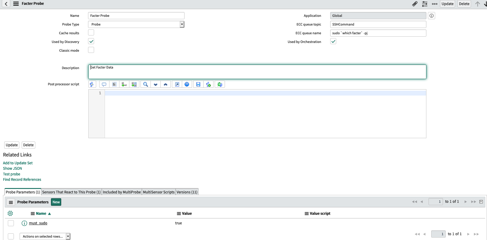

The other day I was trying to create a custom probe/sensor for a probe for our linux machines. 

The only example I could find was to read a text file and make a ci based on that.  That was not what I wanted.

I was specifically asking a program to tell me about its facts and I wanted to relate those details to the currently identified CI.

I couldnt remember how to do this;

Thankfully Rob G. pointed me in the right direction.

- Created Probe to run the command ``sudo `which factor` -pj``
- Created Sensor to respond to the probe
- Opened the Classifiers, and added the Probe to the Linux one
- Created a Test Discovery schedule so I could test the Probe & Sensor

Notes;

- `result.output` is going to be string output as its what's on the shell that is returned.   If it's an object, you gotta parse it.
- `var serverGR = this.getCmdbRecord();` is the way I used to get the currently identified CI.
