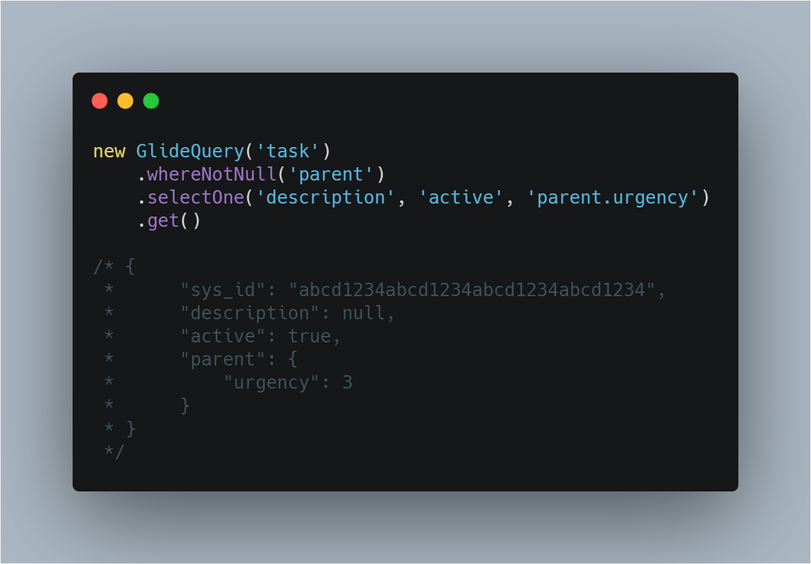
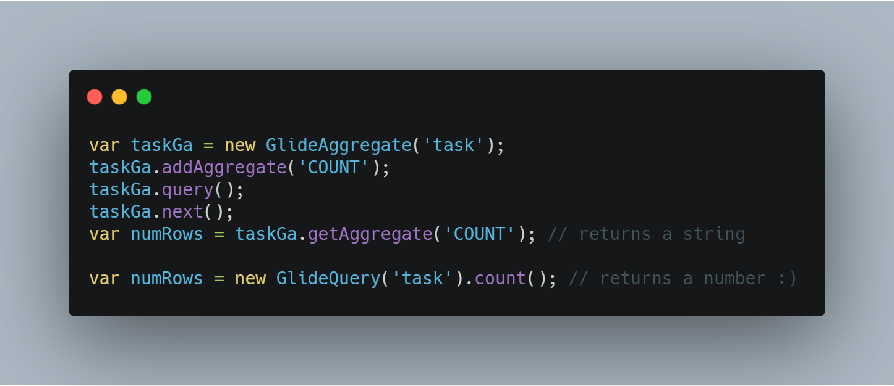
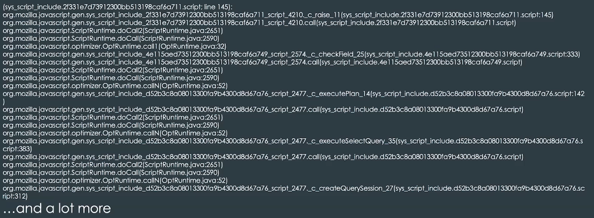
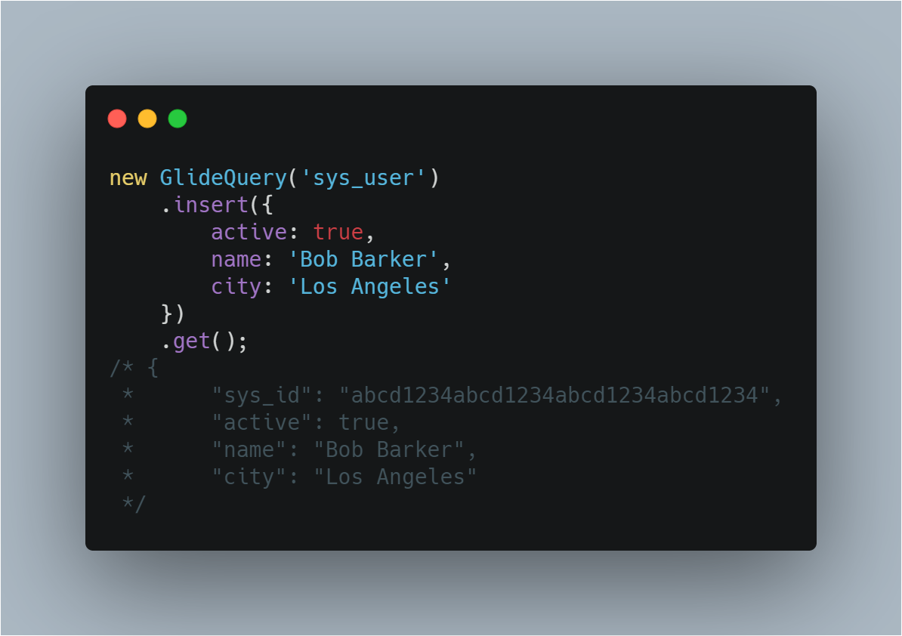
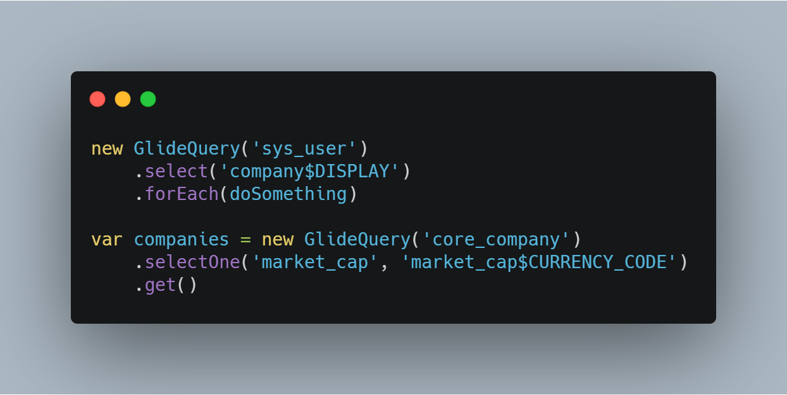
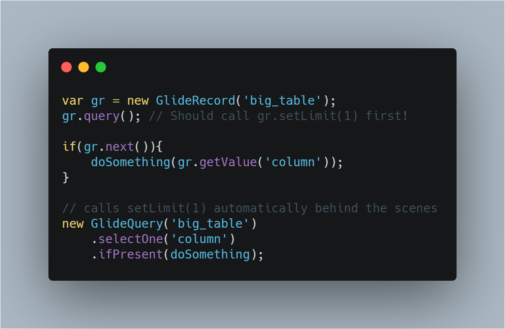

A month ago I [wrote about GlideQuery](../2020-04-28-what-is-glidequery), asking "... is GlideRecord going away?  No.  I don't think so. "  

Well, I need to revise my thoughts on this.  Before I go into why, lets first link to the sources and you can watch the 20+ minute video of the genius (Peter Bell) behind GlideQuery.

Link to that is here: [GlideQuery: A modern upgrade to GlideRecord](https://events.servicenow.com/widget/servicenow/knowledge2020/myagenda/session/1581555110988001mNP1?sessionId=1581555110988001mNP1) <!--https://players.brightcove.net/5703385908001/zKNjJ2k2DM_default/index.html?videoId=ref:K20-CCB3052-->

Okay.  Now that is out of the way lets talk about some of the major points here so if we lose the video we still have this *somewhere* since as of right now this is [not](https://docs.servicenow.com/search?q=GlideQuery) [documented](https://developer.servicenow.com/dev.do#!/search/orlando/All/GlideQuery) **anywhere**.

# What does GlideQuery do that GlideRecord fails?

GlideQuery is a **server-side** only api for querying, updating, and deleting data.  It's being used in Orlando, and Paris.  Behind the scenes it uses GlideRecord but with smart defaults that often will cause problems eventually.

This api follows three guiding principals;
- Fail Fast
- Be JavaScript
- Expressive

There are some considerations;
- Performance

## Failing Fast

Improving the feedback loop

### Field Checking

Here's a GlideRecord script with a problem
By default if a field name is wrong in GlideRecord, it queries **everything**. 

In GlideQuery, this will fail and not execute on error.

| GlideRecord Example | GlideQuery Example |
| --- | --- |
|  |  |

### Choice checking

Here's another example where unless you check your code you may miss it.  This is because it just returns no results.

Really if the api said, hey that value is not valid, that could help you faster.

| GlideRecord Example | GlideQuery Example |
| --- | --- |
|  |  |

### Type checking

Travis Toulson wrote a whole post about [Is GlideRecord GetValue the king of the string](https://codecreative.io/blog/is-gliderecord-getvalue-the-king-of-the-string/)... It's great but this **SOLVES** that whole issue.

| GlideRecord Example | GlideQuery Example |
| --- | --- |
|  |  |
|  |  |

## Be JavaScript
Isolation from Java

### GlideQuery should behave you expect a regular JavaScript should behave.

One problem with GlideRecord, things are not always as they appear.  Sometimes you'll get a value to print but where you might think the value is a type of number it's in fact a string.

| GlideRecord Example | GlideQuery Example |
| --- | --- |
|  |  |
|  | |
|  | |

### Stacktraces

| GlideRecord Example | GlideQuery Example |
| --- | --- |
|  |  |

### Complex Queries should work how you expect

Queries that use both "AND" and "OR" logic.  How do you think this is evaluated?

| GlideRecord Example | GlideQuery Example |
| --- | --- |
|  |  |

In SQL "AND" has priority over "OR".  In GlideRecord, "OR" has priority over "AND" and this causes problems.  In GlideQuery they solve this by being allowing nested GlideQuery methods.

## Expressive

Do more with less

### Returning a Stream or Optional

When reading data with GlideQuery there are two classes used; Stream and Optional

| Stream | Optional |
| --- | --- |
| Used for reading multiple records | Used for reading a single record |
| Returned by `select(1)` | Is considered "empty" if a record isn't found by a query |
| Is lazily evaluated | Returned by `selectOne()`, `insert()`, and `update()` |
| Common Stream methods: - map - flatMap - forEach - reduce - some - any |  Common Optional methods: - get \[throws if empty\] - map - isEmpty - isPresent - ifPresent - orElse |

Examples;

### Aggregation

Examples; 

### Insert

### Delete

### Update

### Field Flags

This is important for currency and display values.

Flags mentioned `$DISPLAY` and `$CURRENCY_CODE`

## Performance

With business rules disabled here's how GlideQuery stacks up to GlideRecord.

| Method | GlideRecord | GlideQuery |
| --- | --- | --- |
| Insert 100 records | 829 ms median | 850 ms median (+2.5%) |
| Reading 1 record | 2ms median | 3ms median (+1 ms) |
| Reading 1,000 record | 86.5 ms median | 90.5 ms median (+4.62%) |
| Reading 10,000 record | 842.5 ms median | 890 ms median (+5.64%) |

It's important to note that GlideQuery avoids common performance mistakes.

## Current Limitations and Future work

- Scoped table permission checking
- Allow opting out of field/choice checking
- Better join support
- Field casting
- Parsing encoded queries
