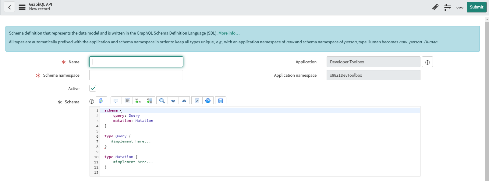

For a while, there's been GraphQL in ServiceNow.  It hasn't been touted as a way to get data, but back in Septempber Aleksas Kucinskas wrote "[How ServiceNow is updating it’s Tech Stack and is using GraphQL](https://servicenowthink.wordpress.com/2019/09/10/how-servicenow-is-updating-its-tech-stack-and-using-graphql/)".

That's great, if you like guessing ServiceNow won't change it.  Thankfully, in [Paris](https://docs.servicenow.com/bundle/paris-application-development/page/integrate/graphql/concept/scripted-graph-ql.html#d1131769e196), they added it as something we simple developers can make.

I've dabbled with GraphQL when setting up GatsbyJS sites, so I thought I could muddle my way through it.  But when I was introduced to the GraphQL definition record, I had a realization. I knew nothing.

