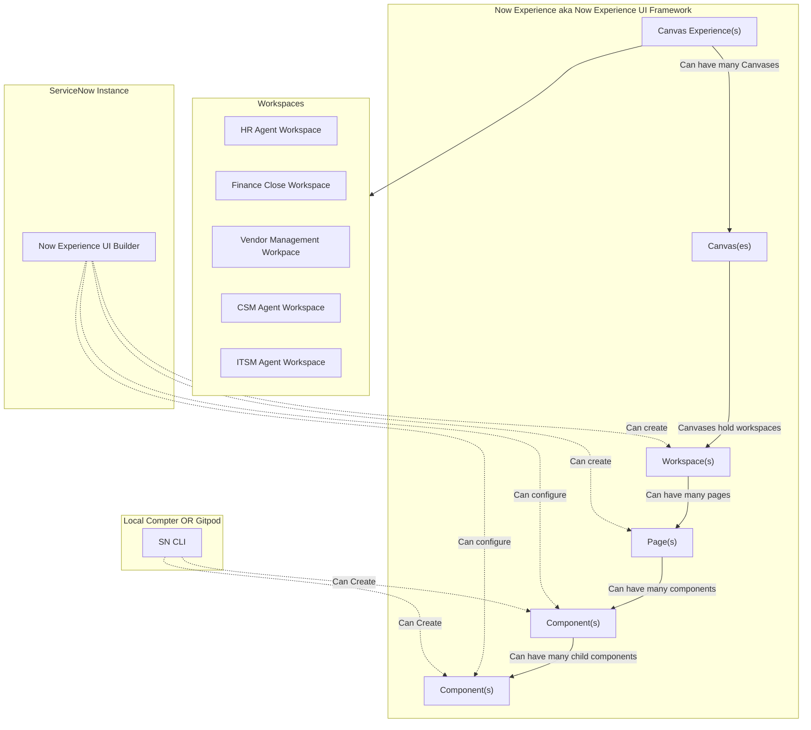

## Now Component Concepts

My rough notes on this, as I get more understanding I'll update this... Sometimes called Tectonic or UI21

[https://developer.servicenow.com/dev.do#!/reference/now-experience/rome/ui-framework/main-concepts/view](https://developer.servicenow.com/dev.do#!/reference/now-experience/rome/ui-framework/main-concepts/view)

### Virtual DOM
 Snabbdom: This is the virtual dom library they use under the hood - tltoulson
 ### State Store / Application State Management
 Redux is one of the most popular state stores in use and ServiceNow drew inspiration from it in creating the Now Experience Framework - tltoulson
 
 ### Actions
 ### Reducers
### One Direction Data Flow
### Hooks
-   React Hooks: Seems to be the inspiration for Effects and how the DOM is tied to the state in NowX ([https://reactjs.org/docs/hooks-intro.html](https://reactjs.org/docs/hooks-intro.html))
### Effects
### Web Components
### Component Based UI
### Shadow DOM

## Tooling

