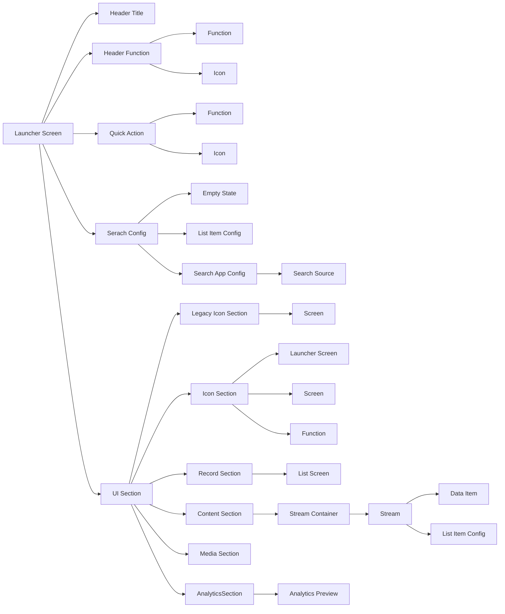

I was looking at the mobile setup for ServiceNow today because I was asked by someone how to get this to work. And it turned into a scavenger hunt, even with these notes here.

Turns out you need a lot more than just what I thought we needed.

## Plugins needed

- Mobile Studio (`com.glide.sg.studio`)
- Geolocation (`com.snc.geolocation`)
- Service Management Geolocation (`com.snc.serivce_management.geolocation`)
- Service Management Geolocation Mobile (`com.snc.serivce_management_m`)
- SG Offline support (`com.glide.sg.offline`)
- ServiceNow NowMobile App Screens and Applet Launcher (`com.glide.mobile-employee`)

for mobile onboarding only

- Human Resources Scoped App (`com.sn_hr_lifecycle_events`)

## Licensing Considerations

Accessing Custom Tables may not be available in "Data Items" due to customer entitlements. A change the property, `subscription.custom_table.enforce_entitlement` The value needs to be set to false

## Definitions

| Term             | Definition                                                                |
|:-----------------|:--------------------------------------------------------------------------|
| Apps             | physical applications downloaded from the app store for the device on which testing will occur (Now Mobile, Mobile Agent) |
| Applications     | applications created and used within the instance. These include new scoped mobile applications that are created, existing scoped mobile applications, including base system applications, such as ITSM Mobile Agent, and existing Now Platform applications, such as System Mobile. |
| Launcher Screens | a homepage or landing page                                                |
| UI Sections      | UI section is in the main area of the Launcher screen and displays a screen or collection of screens. It may be configured as an icon section, which can include multiple applets, a record section, which can include only one screen, an analytics section, a campaign section, a media section, or a navigation section. |
| Navigation Bar   | The navigation bar is a configurable and customizable menu bar that displays Launcher screens, screens, settings, and notifications. It may also be called the dynamic menu bar. |
| dynamic menu bar | The navigation bar is a configurable and customizable menu bar that displays Launcher screens, screens, settings, and notifications. It may also be called the dynamic menu bar. |
| Screens          | Screens are how the data is configured and displayed within the mobile apps. |
| Screen Template  | The screen template determines the features of the screen, what is available for configuration, and how the users will interact with it. The screen templates include: List, Record, Employee Directory, Map, Group List, Calendar, Mobile Web, Input Form, and Chart. However, only List, Record, Input Form, and Mobile Web are available within Mobile App Builder. Additional screens include: Details, Activity Stream, Related List(s), and Embedded List(s). |
| Segment          | Screens can contain multiple segments. The segments display different information relating to the content screen. Segments are displayed as tabs within the screen and can be a details screen, activity stream, related lists, and embedded lists. |
| Item Stream      | An item stream identifies the data stream being used for the screen, as well as its configuration. The item stream contains both a data item and a master item, which determine what is shown and how it is displayed. Multiple item streams can be associated with an screen, which permits one screen to display items from multiple tables using multiple configuration options. |
| Data Item        | Data items are sets of data sets that represent a table or subset of information from a table in the Now Platform. Data items determine the information that appears on a screen within a screen. They are associated with specific screens to determine the purpose of each screen and what information is available within the screen. |
| Cards            | Cards define the pattern for the data to be available and how it appears. |
| Functions        | There are like UI Actions in platform. Functions can be used throughout the mobile apps to complete activities, including but not limited to, jumping to another screen, reassigning a task, and launching the virtual chat. Some functions include actions and may be referred to as such. |

## Apps

1. Mobile Agent - Focused for fulfillers
2. Now Mobile - more for requestors and employees (hr?)

## Hierarchy of Mobile Development

```mermaidjs
flowchart TD
    MobileApp[Mobile App]
    MobileAppConfig[Mobile App Config]
    NavigationBar[Navigation Bar]
    NavigationBarTab[Navigation Bar Tab]
    ScreenTab[Screen Tab]
    LauncherTab[Launcher Tab]
    SavedTab[Saved Tab]
    NotificationsTab[Notifications Tab]
    SettingsTab[Settings Tab]
    Icon[Icon]
    Screen[Screen]
    LauncherScreen[Launcher Screen]
    MobileApp --> MobileAppConfig
    MobileAppConfig --> NavigationBar
    NavigationBar --> NavigationBarTab
    NavigationBarTab --> ScreenTab
    NavigationBarTab --> LauncherTab
    NavigationBarTab --> SavedTab
    NavigationBarTab --> NotificationsTab
    NavigationBarTab --> SettingsTab
    ScreenTab --> Screen
    ScreenTab --> Icon
    LauncherTab --> LauncherScreen
    LauncherTab --> Icon
    SavedTab --> Icon
    NotificationsTab --> Icon
    SettingsTab --> Icon
```

## Tables

| What                                          | Table                                            | Note                                             |
|:----------------------------------------------|:-------------------------------------------------|:-------------------------------------------------|
| Mobile App Config                             | sys_sg_native_client                             | Define what mobile client, Now Mobile, or Mobile Agent for the app. |
| Nagivation Bar                                | sys_sg_nagivation_tab                            | The bottom links                                 |
| Tabs can be split into 5 different .. things? |                                                  |                                                  |
| Screen Tab, Launcher Tab                      | sys_sg_applet_launcher_tab                       |                                                  |
| Saved Tab, Notification Tab, Settings Tab     | ...                                              | Every customer has these... not changeable       |
| Screens                                       | sys_sg_screen                                    |                                                  |
| Launcher Header                               | sys_sg_applet_launcher_header (access from sys_sg_applet_launcher) | Add's custom messages to header                  |
| Launcher Header Function                      | sys_sg_button_instance (access from sys_sg_applet_launcher) | Defines where user goes when they click on header icons |
| Launcher Quick Action                         | Not listed (access from sys_sg_applet_launcher)  | E.g. Create a new record, launch native chat     |
| Launcher Search Config                        | sys_sg_global_search (access from sys_sg_applet_launcher) | Gives ability to search sources from mobile app (Zing for Agent, AI Search or Zing for Now Mobile) |
| UI Sections                                   | sys_sg_section (access from sys_sg_applet_launcher) | constols how screens are displayed onlauncher screens, thing order of the itemson the display |

Screens have a bunch of types, liek list, record etc.

## Launcher Screens



[Youtube](https://www.youtube.com/watch?v=sF-pFb1v73Q&utm_source=jace.pro&utm_medium=referral&utm_campaign=mobile-development-on-servicenow-is-different)

## List Screen

sys_sg_list_screen

List screens require a screen segment `sys_sg_item_stream_segment`. When a list has a single segment, you don't see the segments at the top. Example, "Open" and "Closed" incidents.

Of course. for stream segments to work you need a stream of data `sys_sg_item_stream`. You will have streams of Data Items in a consistent format. The stream however doesn't query the table, it needs a "Data Item" `sys_sg_data_itme`. This is where you say this table is queried.

Item Configuration `sys_sg_master_item` controls how data is displayed on cards. Of course.. the item configuration contains the "Card" sys_sg_view_config. Cards are only built in the Mobile Card Builder, not in anything else.

Card Templates sys_sg_view_tempate define how the ui elements will be arranged in individual cards. Again only editable in Mobile Card Builder.

Card Actions sys_sg_view_config_element or sys_sg_view_template_element gives uses actions on each card. Again only editable in Mobile Card Builder.

## Record Screen

From the List Screen it will be likely you'll land on a record screen from a List Item Config. Record Screen is on table sys_sg_form_screen.

Records can have no segments (default) and just show the fields boom bam done. If you want more segments that can be set up using Record Screen Segment records `sys_sg_form_screen_segment`

Some things you might embed are

- Detail screen
- Activity Stream
- Related List
- Embedded List

## Domain Seperation

In Mobile the "Company" or "Account" fields are used to display appropriate records by domain.

## Mobile Publishing

This allows us to change the icon of the app on the iPhone or android, also colors and what note. Mobile Branding is a "For-Fee" service.

## Compliance

Mobile is also GovCommunityCloud (GCC) compliant making the apps compliant for use in the United States federal, state, and local governments. The environment is FedRAMP High and DoD Impact Leve 4 authorized and compliant. Each mobile app uses FIPS 140-2 certified encryption modules.

## Mobile Card Builder

<https://youtu.be/JAEACheU9dY>

There's a plugin to install.
